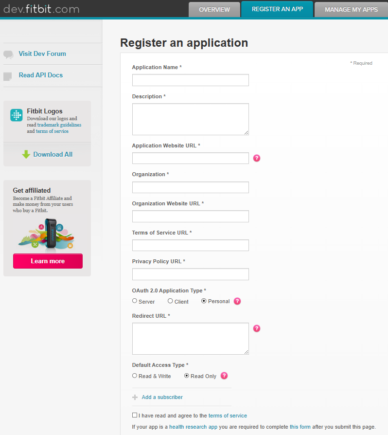
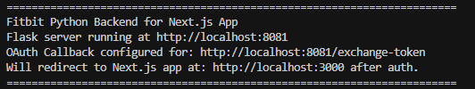
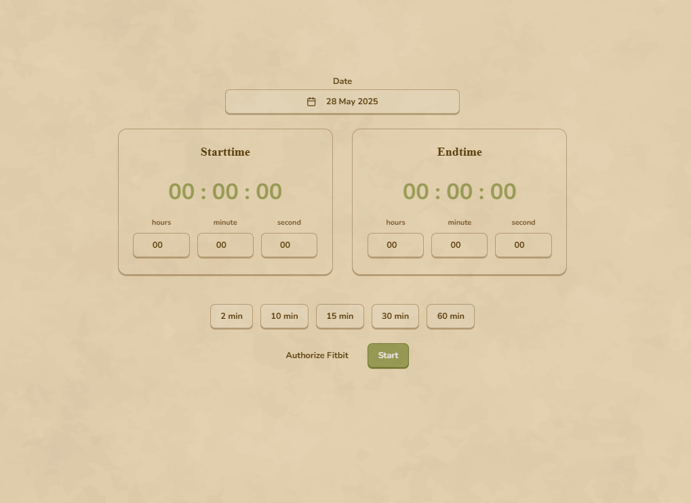
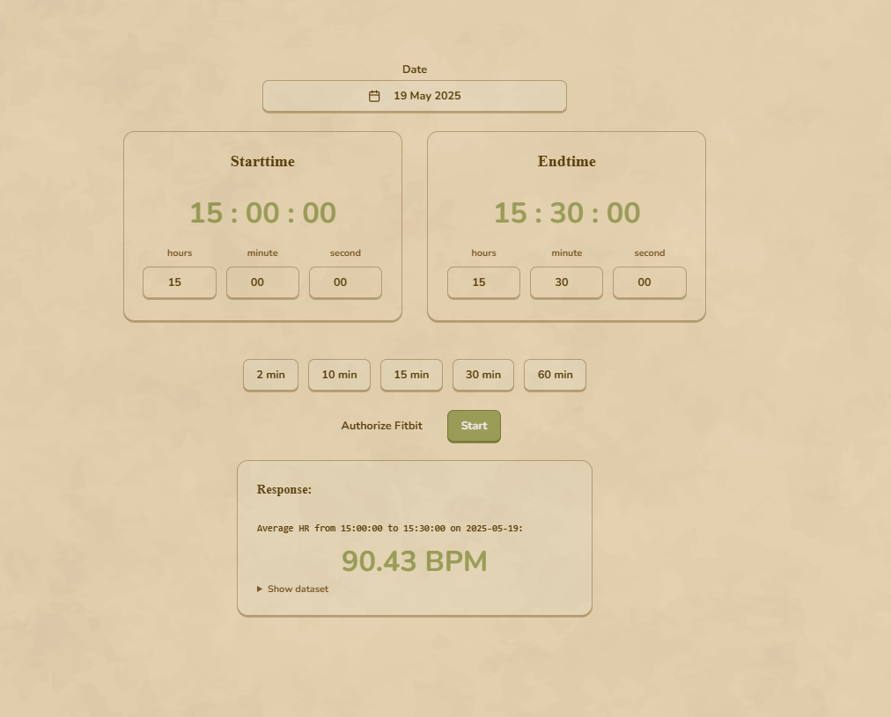

# :heartpulse: Fitbit Heart Rate Timer Application Setup

This guide explains how to set up and run the Fitbit Heart Rate Timer application on your local machine using your own Fitbit account.

## :clipboard: Overview

The application consists of two main parts:

1.  **Next.js Frontend (in the `fitbit-timer-app` folder):** The user interface where you enter time ranges and initiate authorization with Fitbit.
2.  **Python (Flask) Backend (in the `fitbit_api` folder):** The server that handles the OAuth 2.0 authorization flow with Fitbit and fetches heart rate data from the Fitbit API.

## :wrench: Prerequisites

- Node.js and npm (or yarn) (for the Next.js frontend)
- Python 3.x and pip (for the Python backend)
- A Fitbit account

## :rocket: Setup Steps

### Step 1: Create a Fitbit Developer Application

1.  Go to the [Fitbit Developer Portal](https://dev.fitbit.com/) and log in with your Fitbit account.
2.  Register a new application by clicking "MANAGE" > "Register An App" (or a similar option) in the top right.
3.  Fill out the application creation form:

    

    - **Application Name:** (e.g., "My HR Timer App")
    - **Description:** (a brief description)
    - **Application Website:** (not mandatory, you can enter `http://localhost`)
    - **Organization:** (not mandatory)
    - **Organization Website:** (not mandatory)
    - **OAuth 2.0 Application Type:** Select `Personal`.
    - **Redirect URI(s):** This is very important. This is the address where your Python backend server will receive the authorization code from Fitbit. For local development, it will typically be `http://localhost:8081/exchange-token` (assuming your Python server runs on port 8081 and has an `/exchange-token` endpoint). Take note of this URI.
    - **Default Access Type:** Select `Read-Only` or `Read & Write` (`Read-Only` is sufficient as we will only be reading heart rate data).

4.  After submitting the form, you will see the following information on your application's management page. Store this information securely:
    - **OAuth 2.0 Client ID** (This will be your `CLIENT_ID`)
    - **Client Secret** (This will be your `CLIENT_SECRET`)

### Step 2: Clone the Project and Install Dependencies

1.  If you haven't cloned the project yet, open a terminal and clone it:
    ```bash
    git clone <project_git_url>
    cd <project_root_folder>
    ```
2.  **Python Backend Dependencies:**
    Navigate to the `fitbit_api` folder and install the dependencies listed in `requirements.txt` (or as specified):
    ```bash
    cd fitbit_api
    pip install -r requirements.txt
    # Or install the necessary packages manually:
    # pip install Flask requests python-dotenv ...
    cd ..
    ```
3.  **Next.js Frontend Dependencies:**
    Navigate to the `fitbit-timer-app` folder and install the npm (or yarn) dependencies:
    ```bash
    cd fitbit-timer-app
    npm install
    # or yarn install
    cd ..
    ```

### Step 3: Configure Environment Variables

You will need to configure two `.env` files for the application to work correctly.

1.  **For the Python Backend (`fitbit_api/.env`):**
    Create a file named `.env` inside the `fitbit_api` folder and fill it with the following content, using your Fitbit application information:

    ```env
    CLIENT_ID="YOUR_CLIENT_ID_FROM_STEP_1"
    CLIENT_SECRET="YOUR_CLIENT_SECRET_FROM_STEP_1"
    PYTHON_SERVER_CALLBACK_URI="YOUR_REDIRECT_URI_ENTERED_IN_FITBIT_APP_SETTINGS_IN_STEP_1"
    # Example: PYTHON_SERVER_CALLBACK_URI="http://localhost:8081/exchange-token"
    NEXT_PUBLIC_APP_URL="http://localhost:3000" # The address where your Next.js app is running
    ```

    - **IMPORTANT:** The `PYTHON_SERVER_CALLBACK_URI` value must be **exactly the same** as the `Redirect URI` you entered in your Fitbit application settings in Step 1.

2.  **For the Next.js Frontend (`fitbit-timer-app/.env.local`):**
    Create a file named `.env.local` inside the `fitbit-timer-app` folder and set the following content according to your Python backend server's address:

    ```env
    PYTHON_API_URL="http://localhost:8081" # The address where your Python backend server is running
    ```

    - If you run your Python server on a different port, update this URL accordingly.

### Step 4: Run the Application

1.  **Start the Python Backend Server:**
    Open a new terminal, navigate to the `fitbit_api` folder, and start the Python server:

    ```bash
    cd fitbit_api
    python fitbit_Oauth.py
    ```

    You should see a message in the terminal like `Flask server running at http://localhost:8081`.

    

2.  **Start the Next.js Frontend Application:**
    Open another new terminal, navigate to the `fitbit-timer-app` folder, and start the Next.js development server:

    ```bash
    cd fitbit-timer-app
    npm run dev
    # or yarn dev
    ```

    You should see a message in the terminal indicating that the application has started on `http://localhost:3000` (or a different port).

    
    
    _Design inspired by [Matsu Theme](https://matsu-theme.vercel.app) - A Ghibli Studio inspired theme for shadcn/ui_

### Step 5: Use the Application

1.  Open your browser and go to the address where the Next.js application is running (usually `http://localhost:3000`).
2.  Click the "Authorize Fitbit" button near Start button.
3.  You will be redirected to the Fitbit login page. Log in with your Fitbit account and authorize your application to access your data.
4.  After successful authorization, you will be redirected back to the Next.js application.
5.  You can now select the date, start time, and end time, then click the "Start" button to fetch your heart rate data from your Fitbit account.

## :bug: Troubleshooting

- **`invalid_request - Invalid redirect_uri parameter value` Error:**
  This error usually occurs when there's a mismatch between the `PYTHON_SERVER_CALLBACK_URI` value in your `fitbit_api/.env` file and the `Redirect URI` you entered in your Fitbit developer portal application settings. Ensure both values are exactly the same (including protocol, host, port, and path).
- **Python Server Not Starting:**
  Ensure you have installed the necessary Python packages (Flask, requests, python-dotenv).
- **Next.js App Cannot Connect to Python Server:**
  Verify that the `PYTHON_API_URL` value in `fitbit-timer-app/.env.local` is the correct address of your running Python server. Make sure both servers are running and your network settings allow local connections.

If you encounter other issues, please contact me or open issue.
